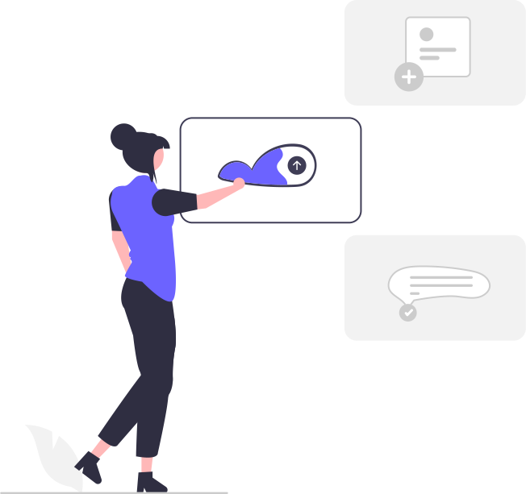

Events in Vue 🚀
==============================

In diesem Beispiel lernst du, wie du in Vue verschiedene Events verwendest, um auf Benutzerinteraktionen zu reagieren. Dies ermöglicht es, dynamisch auf Aktionen wie Klicks, Tastatureingaben oder Mausbewegungen zu antworten.

.. code-block:: vue

    

    <template>
    <button @click="increment">Count is: {{ count }}</button>
    </template>

Event-Referenz
--------------

Nachfolgend findest du eine Tabelle mit einer Übersicht der gängigsten Vue-Events und deren Einsatzbeispiele:

.. list-table::
   :header-rows: 1

   * - Event
     - Beschreibung
     - Beispiel
   * - `@click`
     - Wird ausgelöst, wenn ein Element angeklickt wird.
     - `<button @click="increment">...</button>`
   * - `@mouseover`
     - Wird ausgelöst, wenn die Maus über ein Element fährt.
     - `
...
`
   * - `@mouseout`
     - Wird ausgelöst, wenn die Maus ein Element verlässt.
     - `
...
`
   * - `@keydown`
     - Wird ausgelöst, wenn eine Taste gedrückt wird.
     - `<input @keydown="onKeyDown">`
   * - `@keyup`
     - Wird ausgelöst, wenn eine Taste losgelassen wird.
     - `<input @keyup="onKeyUp">`
   * - `@input`
     - Wird ausgelöst, wenn der Wert eines Eingabefeldes geändert wird.
     - `<input @input="onInput">`
   * - `@submit`
     - Wird ausgelöst, wenn ein Formular abgeschickt wird.
     - `<form @submit.prevent="onSubmit">`
   * - `@focus`
     - Wird ausgelöst, wenn ein Element den Fokus erhält.
     - `<input @focus="onFocus">`
   * - `@blur`
     - Wird ausgelöst, wenn ein Element den Fokus verliert.
     - `<input @blur="onBlur">`

Erklärung der Events
--------------------

- In Vue werden Events über die `@`-Syntax an HTML-Elemente gebunden, um auf Benutzerinteraktionen zu reagieren.
- Die obige Tabelle zeigt einige der am häufigsten verwendeten Events sowie deren Verwendung in der Praxis.
- Jedes Event kann eine eigene Methode aufrufen, die eine benutzerdefinierte Aktion ausführt.

Besonderheiten bei Events 🚨
----------------------------------

In Vue bieten Events zahlreiche erweiterte Features, die speziellere Anforderungen abdecken. Hier sind einige zusätzliche Event-Optionen, die besonders nützlich sind:

1. **Event-Modifikatoren**
   Event-Modifikatoren werden verwendet, um das Verhalten von Events anzupassen:

   .. code-block:: vue

      <template>
          <!-- Verhindert die Standardaktion des Browsers -->
          <form @submit.prevent="onSubmit">...</form>

          <!-- Stoppt die Ausbreitung des Events -->
          <button @click.stop="onButtonClick">...</button>

          <!-- Event nur einmal ausführen -->
          <button @click.once="onButtonClick">...</button>

          <!-- Natives Event auf Kind-Komponenten -->
          <child-component @click.native="onClick">...</child-component>
      </template>

2. **Key-Modifikatoren**
   Key-Modifikatoren ermöglichen es, gezielt auf bestimmte Tasten zu reagieren:

   .. code-block:: vue

      <template>
          <!-- Reaktion auf die "Enter"-Taste -->
          <input @keydown.enter="onEnter">

          <!-- Reaktion auf eine beliebige Taste -->
          <input @keydown.space="onSpace">

          <!-- Kombination mit Shift-Taste -->
          <input @keydown.shift.enter="onShiftEnter">
      </template>

3. **System-Modifikatoren**
   System-Modifikatoren reagieren auf spezielle Tasten wie `Ctrl`, `Alt`, `Shift` oder `Meta`:

   .. code-block:: vue

      <template>
          <!-- Nur wenn gleichzeitig `Ctrl` gedrückt wird -->
          <button @click.ctrl="onCtrlClick">...</button>

          <!-- Alt-Taste als Voraussetzung -->
          <button @click.alt="onAltClick">...</button>
      </template>

4. **Event-Verkettung**
   Mehrere Events können kombiniert werden, um komplexe Interaktionen abzubilden:

   .. code-block:: vue

      <template>
          <input 
              @keydown.enter="onSubmit" 
              @keydown.esc="onCancel">
      </template>
      
      
      
Besonderheit von `.stop` 🚧
---------------------------

Der `.stop`-Modifikator wird verwendet, um die Ausbreitung eines Events im DOM zu stoppen. Das bedeutet, dass das Event nicht weiter an die übergeordneten Elemente weitergegeben wird (kein Event-Bubbling).

Hier ein Beispiel, das den Unterschied illustriert:

.. code-block:: vue

   <template>
       

           <!-- Klick auf dieses Element stoppt das Event-Bubbling -->
           <button @click.stop="onButtonClick">Klicke mich</button>
       

   </template>

   

**Erklärung:**

1. Wenn der Button ohne `.stop` geklickt wird:
   - Das `@click`-Event wird auf dem Button ausgelöst und die Methode `onButtonClick` wird ausgeführt.
   - Anschließend wird das Event an das übergeordnete `div` weitergegeben und `onParentClick` wird ebenfalls aufgerufen (Event-Bubbling).

2. Wenn der Button mit `.stop` geklickt wird:
   - Das `@click`-Event wird nur auf dem Button verarbeitet (`onButtonClick` wird ausgeführt).
   - Das Event wird **nicht** an das übergeordnete `div` weitergegeben, daher wird `onParentClick` **nicht** ausgeführt.

**Praktischer Nutzen:**
- Du kannst so sicherstellen, dass nur spezifische Elemente auf ein Event reagieren, ohne dass versehentlich übergeordnete Elemente ebenfalls das Event behandeln.

**Konsole-Ausgabe im Beispiel:**
- Mit `.stop`: `Button wurde angeklickt`
- Ohne `.stop`: 